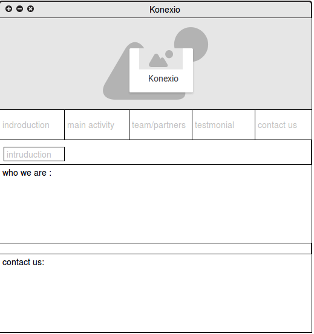
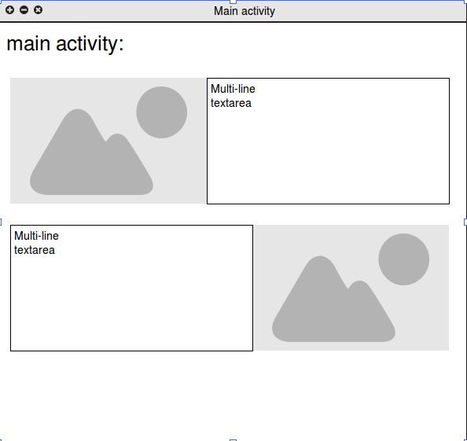
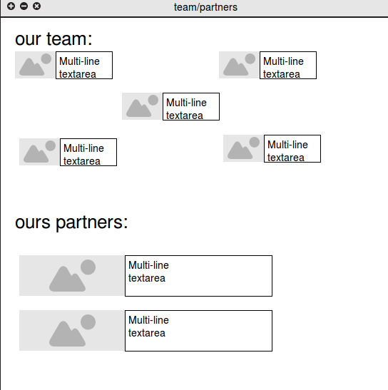
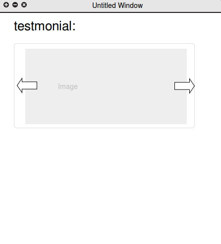

## konexio

It is blog for association that help people for study the programing languages, this blog help to explains all the activites and how to contact with the association, There are two page : 
* Statistic page: the section can everyone see it but can not add , delete or update some text in the page.
* Dynamic page: the section can give us authorization for add , delete or update some text in the page.

## Getting Started

download all the folders and files and  you will want to install a web server, such as »  [Apache](http://httpd.apache.org/), and of course »  [PHP](http://www.php.net/downloads.php) . You will most likely want to install a database as well, such as »   [MySQL](http://dev.mysql.com/doc/)  » [phpMyAdmin](https://docs.phpmyadmin.net/en/latest/setup.html). 

### Installing

After you install all this programes you can create the database like:

- Database: `konexion`

- Table structure for table `article`

CREATE TABLE IF NOT EXISTS `article` (
  `id` int(100) NOT NULL AUTO_INCREMENT,
  `text` longtext NOT NULL,
  `title` varchar(100) NOT NULL,
  PRIMARY KEY (`id`)
) ENGINE=InnoDB  DEFAULT CHARSET=latin1 AUTO_INCREMENT=26 ;

- Table structure for table `login`

CREATE TABLE IF NOT EXISTS `login` (
  `id` int(100) NOT NULL AUTO_INCREMENT,
  `email` varchar(100) NOT NULL,
  `password` varchar(100) NOT NULL,
  PRIMARY KEY (`id`)
) ENGINE=InnoDB  DEFAULT CHARSET=latin1 AUTO_INCREMENT=2 ;

In the file connect.php, change the username and password of the database like you have in your local server and now it is ready.

## Built With

* [HTML](http://html.com/) 
* [CSS3](http://www.css3.info/) 
* [BOOTSTRAP](http://getbootstrap.com/)
* [PHP](http://www.php.net/) 
* [MYSQL](http://dev.mysql.com) 
* [phpMyAdmin](https://docs.phpmyadmin.net/) 
* [jQuery](https://jquery.com/) 

## Mockups

 

# License
All rights reserved to:
* Elmardi YAHYA YACOUB
* Suliman ABDELGADIER

